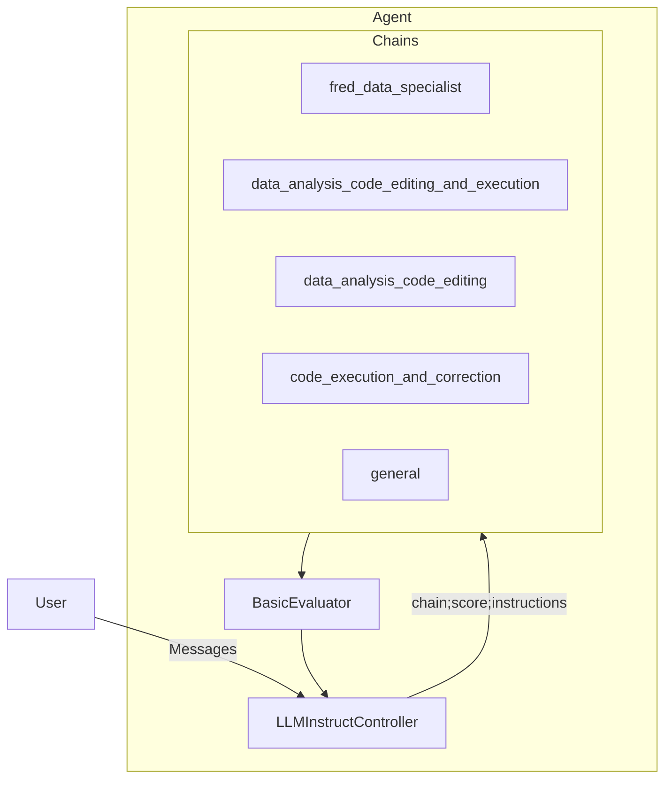
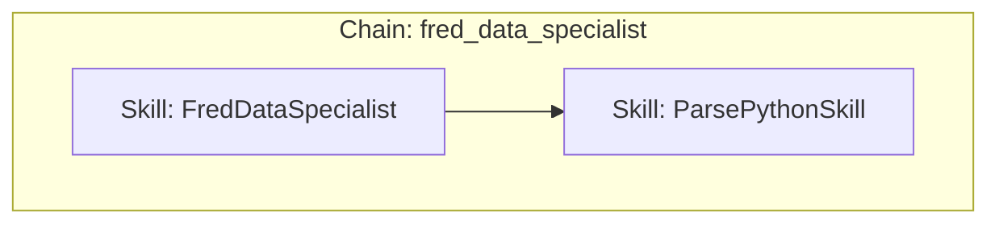
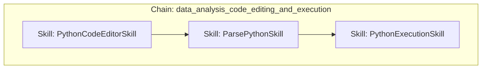
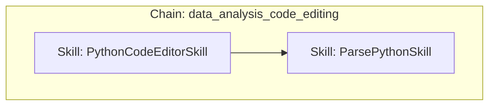
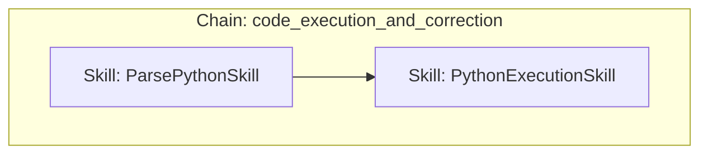
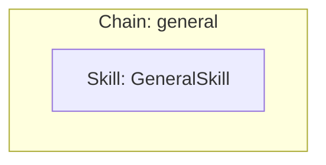

# Custom Agent for Analysis of FRED Data

A demo that uses a Council Agent to access data from FRED and generate Python code for data analytics. Runnable as a notebook or as a Flask/JavaScript app with a UI.

There is a custom controller, which is a development version of `LLMInstructController`
- `src/agent/council_controller.py`

## Prerequisites

To run the demo as-is, you'll need an [OpenAI API Key](https://platform.openai.com/account/org-settings) and a [FRED API Key](https://fred.stlouisfed.org/docs/api/api_key.html).

## Council Components

We define an **Agent**:

With **Chains**:

## Running the demo

- Create a new Python/conda environment
- Install dependencies using `pip install -r requirements.txt` (outdated - this should be much smaller)
- Set up a the Python sandbox
  - cd to `src/agent`
  - `python -m venv code_sandbox`
  - `source code_sandbox/bin/activate`
  - `pip install pandas plotly seaborn scikit-learn`
- Populate your `.env` file with
  - Make a copy of `.env.example` and rename it to `.env`
  - OpenAI API Key
  - FRED API Key
  - Python sandbox `bin` directory
- Run the notebook `src/run_agent.ipynb`
- Run the Flask app 
  - `cd src/flask-app`
  - `python app.py` and open the webpage (from Finder/Explorer etc.) `src/flask-app/index.html`

### Note
If you are experiencing problems with the Flask app / UI, try restarting both the Flask app **and your browswer**.

